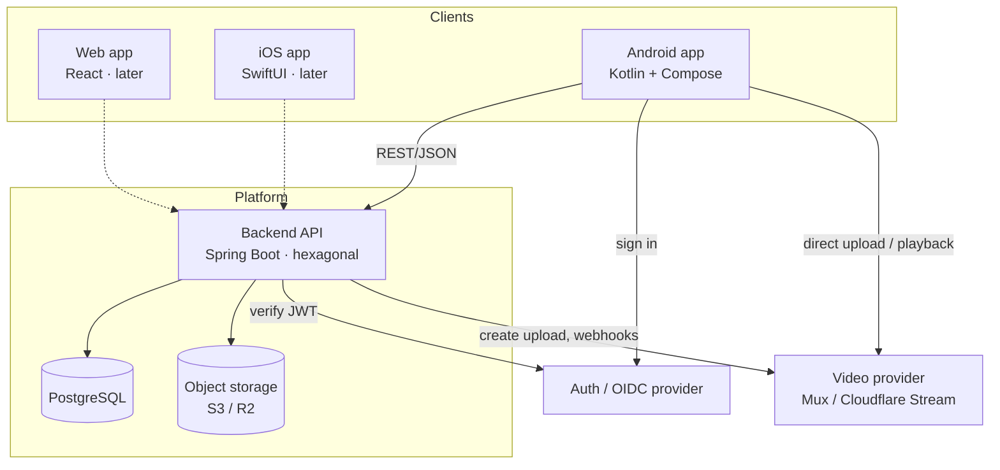
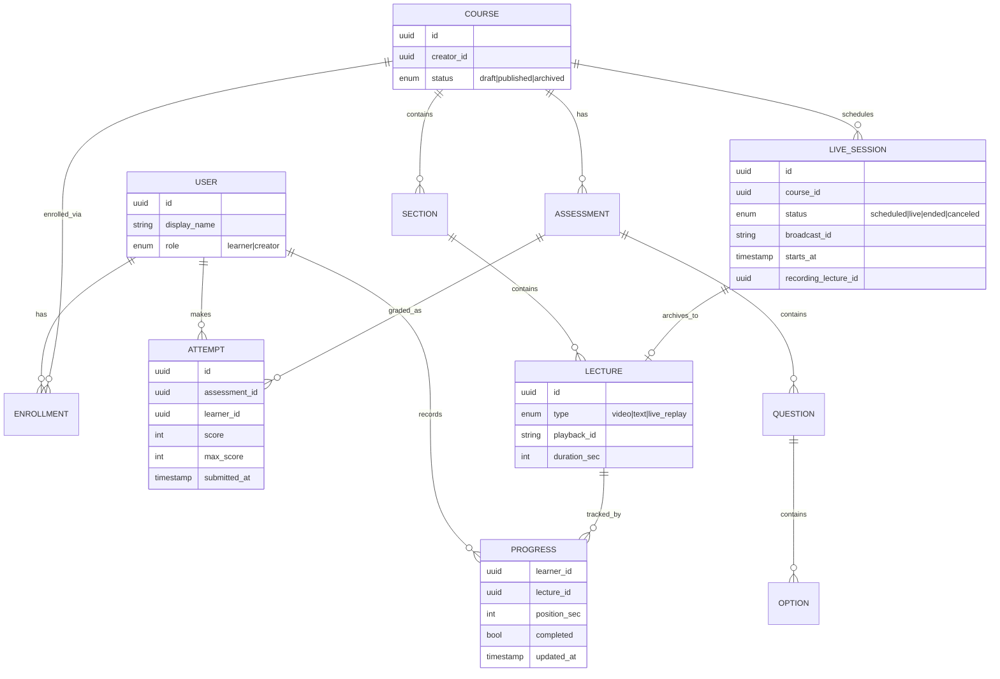

# Architecture

Design follows the journeys in [USER_JOURNEYS.md](USER_JOURNEYS.md). Modules exist to serve
those flows.

> **Chosen realization:** this document describes the general shape (client-agnostic API,
> hexagonal backend, external auth + video). The concrete **$0 nonprofit stack we're building
> on** — Supabase for Postgres/Auth/Storage, YouTube/Vimeo for video, free backend hosting —
> is specified in [STACK.md](STACK.md). Where this doc says "video provider (Mux/CF Stream)"
> or "object storage (S3/R2)", read it as **YouTube/Vimeo** and **Supabase Storage** for the
> MVP; the module boundaries are identical, only the adapter behind the port changes.

## System context



Key property: **video bytes and auth flow bypass our backend.** The backend owns domain data
and orchestration only. That keeps it small and cheap to run.

## Domain model



`PROGRESS` is unique on `(learner_id, lecture_id)` — upsert target. `ATTEMPT` retains every
attempt; the **leaderboard reads the best attempt per learner**.

## Backend: hexagonal, explicit wiring

Matches the house style used across these repos: framework-free domain, no annotation magic.

```
com.coursecraft
├── Application.java
├── domain/
│   ├── service/     # CourseService, ProgressService, AssessmentService, LeaderboardService, LiveSessionService
│   ├── object/      # Course, Lecture, Progress, Attempt, Question … (plain records)
│   └── config/      # domain-level value config
├── port/            # OUTBOUND interfaces only: CourseStore, ProgressStore,
│                    #   AttemptStore, VideoProvider, ...  (no inbound port layer)
├── adapter/
│   ├── in/
│   │   ├── endpoint/ # REST controllers calling domain services directly
│   │   └── config/   # InboundConfig — wires controllers by hand
│   └── out/
│       ├── client/   # JdbcClient stores, Mux/CF client, OIDC verify
│       └── config/   # OutboundConfig — wires adapters by hand
└── config/           # DomainConfig — wires services by hand
```

Rules carried over from the house style:
- **No** `@Autowired` / `@Component` / `@Service` / `@Repository` / `@Controller`. Every bean
  is built by hand in exactly three `@Configuration` classes: `DomainConfig`,
  `InboundConfig`, `OutboundConfig`.
- Config values via `Environment` / `Binder`, **not** `@Value`.
- **No JPA** — `JdbcClient` + `schema.sql` so every query is visible and greppable.
- `domain/service` and `domain/object` stay free of Spring / HTTP / SQL imports (SLF4J is
  fine).

## API surface (first cut)

| Method & path | Journey | Notes |
| --- | --- | --- |
| `POST /creators` | CJ-1 | Upgrade caller to creator. |
| `POST /courses`, `PATCH /courses/{id}`, `POST /courses/{id}/publish` | CJ-2, CJ-5 | Authoring. |
| `POST /lectures/{id}/upload-url` | CJ-3 | Returns provider direct-upload URL. |
| `POST /webhooks/video` | CJ-3 | Provider → mark lecture READY. |
| `POST /assessments`, `POST /assessments/{id}/questions` | CJ-4 | Build assessment. |
| `GET /courses`, `GET /courses/{id}` | LJ-1 | Discovery (published only). |
| `POST /courses/{id}/enroll` | LJ-1 | Enrollment. |
| `GET /lectures/{id}/playback` | LJ-2 | Signed URL + `resumeAtSeconds`. |
| `PUT /progress` | LJ-2/3 | Idempotent upsert on `(learner, lecture)`. |
| `POST /assessments/{id}/attempts`, `POST /attempts/{id}/submit` | LJ-4 | Server-side grade & limits. |
| `GET /assessments/{id}/leaderboard`, `GET /courses/{id}/leaderboard` | LJ-5 | Best-per-learner ranking. |
| `POST /live-sessions`, `POST /live-sessions/{id}/start`, `POST /live-sessions/{id}/end` | CJ-7 | Schedule / go live / end; ends → archive to a lecture. Stream key returned only to the owning creator. |
| `GET /live-sessions/{id}`, `GET /courses/{id}/live-sessions` | LJ-7 | Attend: status + embed id; countdown when scheduled, replay when ended. |

## Android client shape

- **Kotlin + Jetpack Compose**, MVVM with unidirectional state (ViewModel → immutable UI
  state → composables).
- **Media3 / ExoPlayer** for HLS playback + position tracking.
- **Retrofit/Ktor** client, **Room** for the local progress cache + offline queue.
- **WorkManager** to flush queued progress/attempt writes when connectivity returns.
- Feature modules mirror the journeys: `auth`, `discover`, `player`, `progress`,
  `assessment`, `leaderboard`, `creator-studio`.

## Cross-platform decision

Two viable paths for reaching iOS + Web after Android:

| Option | Pros | Cons | Verdict |
| --- | --- | --- | --- |
| **Native per platform** (Compose / SwiftUI / React) over one REST API | Best video + platform feel; backend already client-agnostic | Three UIs to build | **Recommended** — ship Android native now; iOS/Web are additive, not rewrites. |
| **Flutter** (single codebase all three) | One UI codebase | Video/HLS + native player quirks; team ramp | Reasonable if solo and speed > polish. |
| **Compose Multiplatform** | Reuse Kotlin/Compose on iOS + Web | iOS/Web targets less mature; video story weakest | Revisit later, not for MVP. |

Because the backend is a plain REST API, this choice is **reversible** and does not block the
MVP. Start Android-native.

## Non-functional notes

- **Security:** JWT verified on every request; grading + attempt limits server-side; signed,
  expiring playback URLs; creators can only mutate their own courses.
- **Scale levers:** leaderboard reads are hot → cache/materialize best-score-per-learner;
  progress writes are frequent → throttle client-side + upsert.
- **Observability:** structured logs + basic metrics (enroll, play, submit, publish) from day
  one, consistent with the other repos here.
