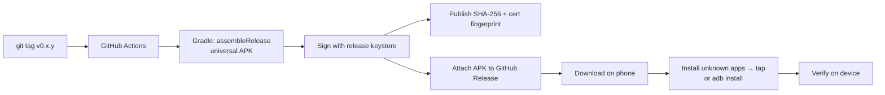

# Distribution & hosting — how each client reaches users

How we publish the Android app, the iOS app, and where the web app is hosted — with the
nonprofit / $0 angle for each. (Verified against 2026 program terms; see sources at the end.)

## MVP distribution: sideloaded, portable APKs (no store)

For the MVP we do **not** publish to any store. We ship a **portable, signed APK** that can be
manually installed and verified on a real Android phone. This keeps the MVP at **literal $0**
(not even the one-time Google $25) and makes every build testable on-device immediately.

- **Artifact:** a **signed universal release APK** — one file that installs across ABIs
  (arm64, armeabi-v7a, x86_64), so it's portable across phones. (An AAB is *not* used here —
  that format is only for Play Store upload.)
- **Signing:** a dedicated **release keystore**; the key lives in **GitHub Actions secrets**,
  never in the repo. Every APK is signed with the same key so upgrades install over each
  other.
- **Distribution channel ($0):** attach the APK to a **GitHub Release** (tagged, e.g.
  `v0.1.0-mvp`). Public repo → anyone with the link can download it. CI builds + signs +
  uploads on every tag.
- **Install on a phone:** enable **"Install unknown apps"** for the browser/file manager,
  download the APK, tap to install — or `adb install coursecraft-v0.1.0.apk` over USB.
- **Verify it's genuine:** the release notes publish the APK's **SHA-256 fingerprint** and the
  **signing certificate fingerprint**; a recipient checks `sha256sum` (or
  `apksigner verify --print-certs`) before installing.

**2026 note:** Google's developer-verification decree (from Sept 2026) will eventually tie
even sideloaded apps to a registered developer identity. For MVP testing on our own / pilot
devices this is fine; store registration is only needed when we move to public distribution
(below).

## Post-MVP: store publishing & web hosting

Everything below applies **after** the MVP, when moving from sideloaded APKs to public stores.

## Cost summary

| Client | Channel | Cost | Nonprofit angle |
| --- | --- | --- | --- |
| **Android (MVP)** | **Sideloaded signed APK via GitHub Releases** | **$0** | No store, no fee — manual install + verify on device. |
| **Android** | Google Play | **$25 one-time** | No nonprofit fee waiver; $25 is a one-off, not annual. |
| **iOS** | App Store (Apple Developer Program) | $99/yr → **$0 with waiver** | Nonprofit fee waiver zeroes the annual fee (conditions below). |
| **Web** | Static host (Cloudflare Pages / GitHub Pages / Netlify) | **$0** | Free tiers cover it entirely. |

So the realistic floor is **a single $25 one-time Google fee**; iOS is $0 if the nonprofit
waiver is approved, and web is $0.

## Android

- **Channel:** Google Play Store. A Play developer account is a **one-time $25** registration
  (identity verification + government ID). There is **no nonprofit waiver** for it, but it's
  not recurring.
- **2026 change to know:** Google's **developer-verification decree** (phased rollout from
  Sept 2026) requires *every* Android app — including sideloaded APKs and third-party stores
  like F-Droid — to be tied to a **registered developer identity**. So "just host the APK for
  free" is going away; plan on registering regardless of channel.
- **Practical plan:** publish to Google Play under an **organization** developer account
  (register the nonprofit as the developer, not a personal account). Optionally also list on
  **F-Droid** later (fits our MIT/OSS license) for a fully-open channel — subject to the same
  new registration rules.
- **Build:** signed **AAB** (Android App Bundle) produced by the Gradle build in CI; Play App
  Signing manages the release key.

## iOS

- **Channel:** Apple App Store, via the **Apple Developer Program** ($99/year).
- **Nonprofit fee waiver → $0/year.** Apple waives the annual fee for a legal **nonprofit,
  accredited educational institution, or government entity**. To qualify:
  - Be a **legal entity** (not an individual/sole proprietor) — needs a **D-U-N-S number**.
  - **Not** sign the Paid Applications Agreement and **not** sell digital goods/services in
    the app. ✅ CourseCraft courses are free, so this fits.
  - Be in an eligible region (US, UK, EU majors, Canada, Australia, Japan, etc.).
  - Apply by choosing "request a fee waiver" during enrollment (or before renewal if already
    enrolled).
- **No free public sideloading path** on iOS — the App Store (with the waiver) is the route.
  **TestFlight** (included with the program) covers beta distribution.
- **Build:** the SwiftUI app is a later phase (Phase 5), but the account/waiver is worth
  applying for early since approval takes time.

## Web

The web app (Phase 5) is a **static single-page app** (React) that talks to our backend API —
so it needs only static hosting, which is free:

| Host | Why | Notes |
| --- | --- | --- |
| **Cloudflare Pages** | Unlimited bandwidth on free tier; same ecosystem as a future Project Alexandria upgrade | ⭐ Recommended |
| **GitHub Pages** | Simplest for this public repo; deploy from CI | Great for an MVP/landing |
| **Netlify / Vercel** | Generous free tiers, preview deploys | Fine alternatives |

- **Deploy:** GitHub Actions builds the SPA and publishes to the chosen host on every push to
  `main`. **$0.**
- **Custom domain:** a domain is the only optional cost (~$10/yr) if the nonprofit wants
  branding; the host itself stays free, and the default `*.pages.dev` / `*.github.io`
  subdomain works at $0.

## What this means for the plan

- **Budget floor:** one **$25 one-time** Google Play fee. Everything else is $0 if the Apple
  nonprofit waiver is approved and the web app uses a free host + default subdomain.
- **Start early:** register the nonprofit as an **organization** on both stores and file the
  **Apple fee-waiver** request now — the D-U-N-S lookup and Apple's review add lead time.
- **Keep courses free** in-app to preserve Apple waiver eligibility; if paid courses are ever
  introduced, the waiver is lost and the $99/yr applies.

---

### Sources
- [Apple Developer Program fee waivers](https://developer.apple.com/help/account/membership/fee-waivers/)
- [Apple: government & nonprofit fee waiver overview](https://howtoremoveapp.com/howtoguides/apple-waives-developer-fee-non-profits/)
- [Google Play $25 registration + 2026 developer verification](https://dev.to/dev-arafat-alim/android-is-losing-its-freedom-googles-2026-developer-verification-explained-2b5p)
- [F-Droid on Google's developer-registration decree](https://f-droid.org/2025/09/29/google-developer-registration-decree.html)
