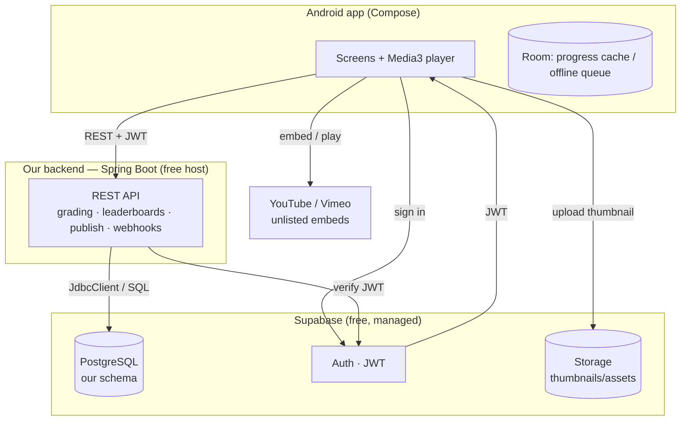

# Stack & Storage — the $0 nonprofit setup

This is the chosen stack: **our own Spring Boot backend for domain logic, Supabase as the
managed data layer, YouTube/Vimeo unlisted for video.** Target cost: **$0** to run the MVP.

## What "this setup" means

We do **not** buy or operate any database infrastructure. Instead:

- **Supabase** (free tier) hosts the things that are painful to run ourselves: the
  **PostgreSQL database**, **user authentication**, and **file storage** for images.
- **We still build and run our own backend** — a small Spring Boot service — because the
  product needs server-authoritative logic (grading, attempt limits, leaderboards) that must
  not live on the client and shouldn't be expressed as database rules.
- **Video never costs us anything**: lectures are uploaded to **YouTube/Vimeo as unlisted**
  and embedded. We store only the video id. This is the deliberate trade for a nonprofit
  publishing open educational content — no transcoding or bandwidth bill.

The split in one line: **Supabase manages *data*; our backend owns *decisions*; the video
provider owns *video*.**

## How the architecture looks

- The Android app authenticates **directly against Supabase Auth** and gets a JWT.
- Every domain call goes to **our backend**, which **verifies that JWT** and reads/writes
  Postgres over `JdbcClient`.
- Thumbnails go straight to **Supabase Storage**; video plays straight from **YouTube/Vimeo**.
  Neither large-blob path flows through our backend.

## What it costs

| Piece | Provider | Plan | Monthly cost |
| --- | --- | --- | --- |
| Database + Auth + file storage | Supabase | Free (500 MB DB, 1 GB files, 50k users) | **$0** |
| Video hosting + delivery | YouTube / Vimeo | Free (unlisted) | **$0** |
| Backend hosting | Render / Fly.io | Free web service | **$0** |
| Source & CI | GitHub / Actions | Free for public repo | **$0** |
| **Total** | | | **$0 / month** |

Caveats that come with $0 (all manageable):
- **Supabase pauses a project after 7 days of no requests** → a free **GitHub Actions cron**
  pings it to keep it awake.
- **Free backend hosts sleep when idle** → first request after idle is a slow cold start. A
  JVM app is memory-hungry on tiny free tiers; if it doesn't fit, compile a **GraalVM native
  image** (small, fast-start) or keep the backend thin.
- **Unlisted video is not true access control** — anyone with the link can view it. Fine for
  open educational content; revisit with signed streaming (Cloudflare Stream via **Project
  Alexandria** nonprofit credits) if lectures ever need to be gated.

## What we build as our own backend

The Spring Boot service (still **strict hexagonal**, per [ARCHITECTURE.md](ARCHITECTURE.md))
owns only what *must* be server-side and untrusted-by-the-client:

- **Assessment grading** — receive answers, compute score. Correct answers never reach the
  client before submit.
- **Attempt rules** — enforce attempts-allowed and time limits server-side.
- **Leaderboards** — compute best-score-per-learner ranking and a learner's own rank.
- **Publish validation** — enforce "has a section, a ready lecture, a thumbnail" before a
  course goes public.
- **Course/lecture/assessment authoring** writes and ownership checks (a creator may only
  edit their own courses).
- **Progress upserts** — the idempotent `(learner, lecture)` write and course-% derivation.
- **Video linking** — validate/normalize the YouTube/Vimeo id a creator pastes; store it.

It stays framework-free in the domain, `JdbcClient` + `schema.sql` against the Supabase
Postgres, explicit bean wiring — nothing about using Supabase changes that style. Supabase is
just the Postgres connection string plus a JWKS URL to verify tokens.

## What we manage inside Supabase

We treat Supabase as three managed services and own their configuration:

| In Supabase | We manage | Notes |
| --- | --- | --- |
| **Postgres** | Our `schema.sql` + migrations; indexes for leaderboard/progress | Same schema we'd run anywhere; Supabase just hosts it. |
| **Row-Level Security** | Policies so a learner reads only their own `progress`/`attempts` | Defense-in-depth even though the backend is the main gatekeeper. |
| **Auth** | Providers (email/OIDC), JWT settings, `learner` default role | Backend verifies JWTs via Supabase's JWKS; we never store passwords. |
| **Storage** | Buckets + access rules for thumbnails/assets | Public-read bucket for thumbnails; signed uploads from the app. |
| **Keep-alive** | A GitHub Actions cron hitting the DB | Prevents the 7-day idle pause. |

What we **don't** manage: the database server, backups, patching, TLS, or scaling — Supabase
does all of that on the free tier.

---

**Net:** one managed account (Supabase) + one small backend we host free + free video = a
production-shaped MVP at **$0/month**, with a clear upgrade path (TechSoup verification →
nonprofit cloud credits / Project Alexandria) if it outgrows the free tiers.
