# User Journeys

Two personas drive the whole product:

- **Creator / Teacher** — authors and publishes courses, lectures, and assessments.
- **Learner / Student** — discovers courses, watches lectures, resumes progress, takes
  assessments, and compares scores on leaderboards.

A third implicit actor is the **Platform** (backend + video provider + auth). The journeys
below are the source of truth: modules and APIs are designed to serve them, not the reverse.

---

## Persona map

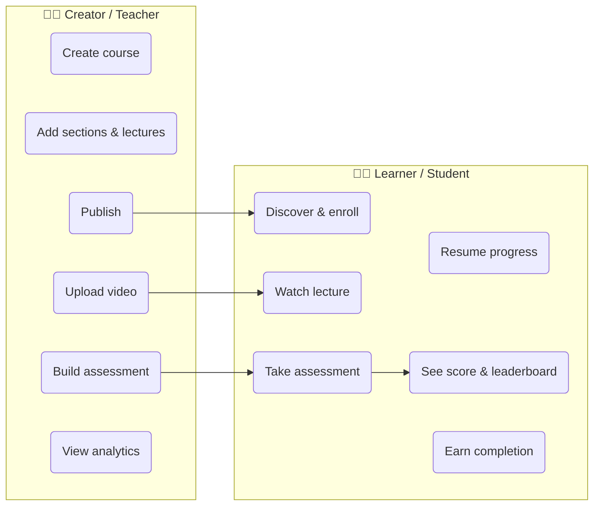

---

# Creator journeys

## CJ-1 — Onboard & become a creator

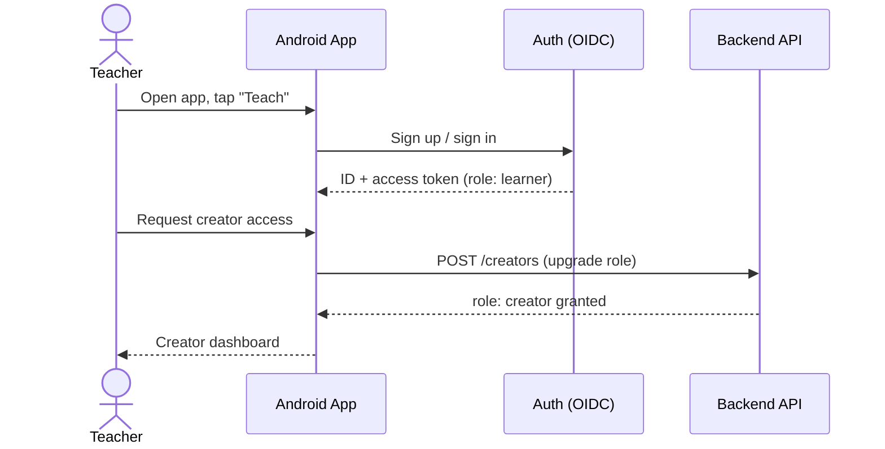

**Notes:** everyone signs in as a learner by default; becoming a creator is an explicit
role upgrade. Keep it self-serve for MVP (no manual approval) but gate publishing behind a
completed profile.

## CJ-2 — Author a course (course → sections → lectures)

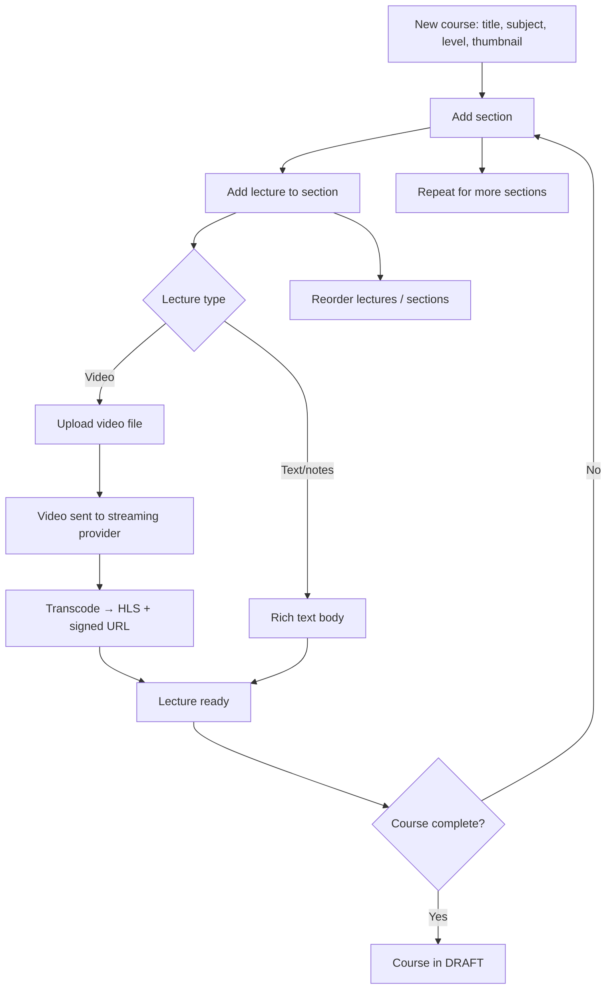

Course state machine: `DRAFT → PUBLISHED → (UNPUBLISHED / ARCHIVED)`. Learners only see
`PUBLISHED`.

## CJ-3 — Upload a video lecture (async pipeline)

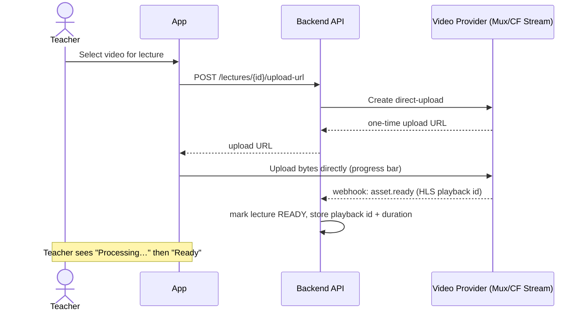

**Why direct-to-provider upload:** the video bytes never touch our backend, so we don't
build storage or transcoding. We only store metadata + the playback id.

## CJ-4 — Build an assessment

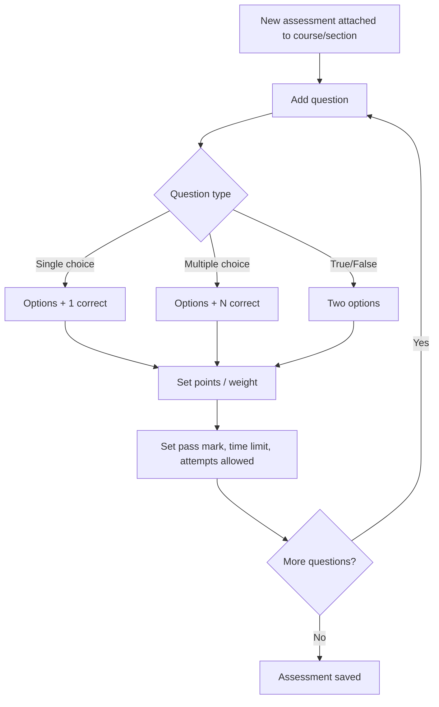

MVP question types: single-choice, multiple-choice, true/false — all **auto-gradable** so
scoring and leaderboards need no human grading. (Free-text / essay is a later phase and
needs manual or AI grading.)

## CJ-5 — Publish & manage

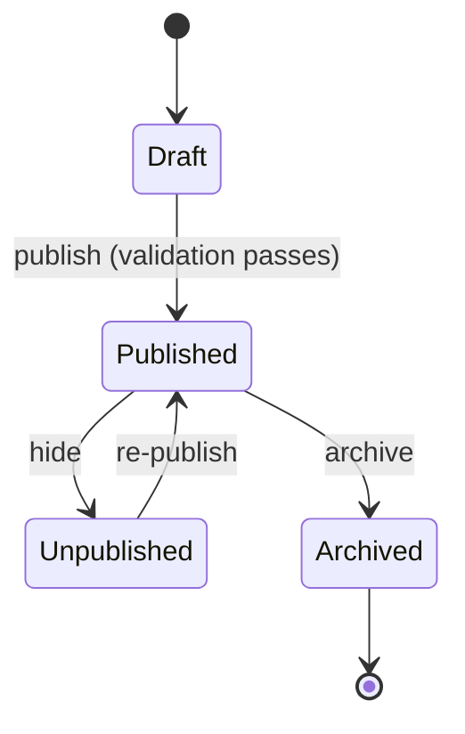

Publish validation: at least one section, one ready lecture, thumbnail present. Editing a
published course creates edits in place (MVP) — versioning is a later concern.

## CJ-6 — View analytics

Enrollment count, per-lecture completion rate, average assessment score, and the leaderboard
for their own assessments. Read-only dashboard backed by aggregate queries.

---

# Learner journeys

## LJ-1 — Discover & enroll

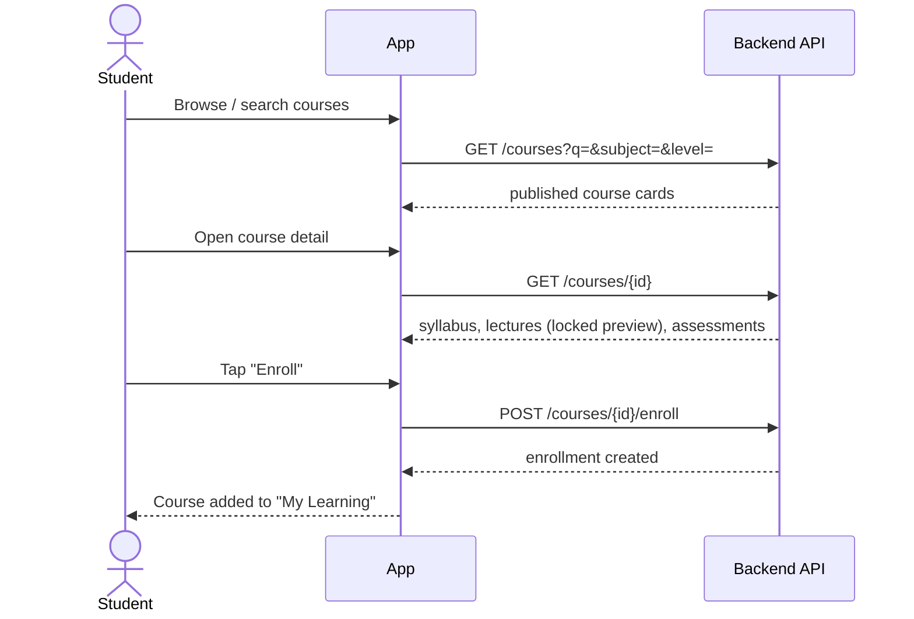

## LJ-2 — Watch a lecture with progress saving  ⭐ core

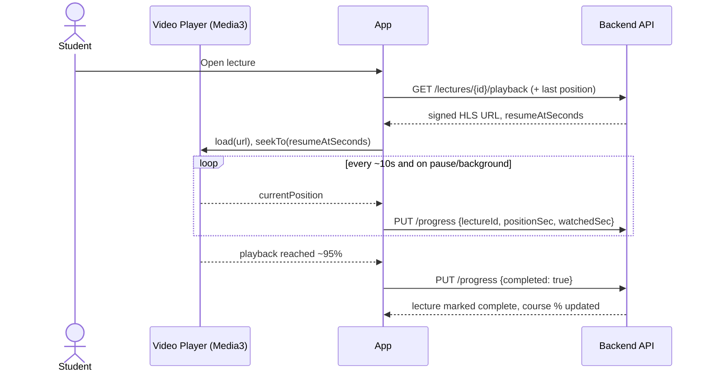

**Progress design:**
- Progress is throttled (every ~10s + on pause/seek/background) to avoid write storms.
- Writes are **idempotent upserts** keyed by `(learnerId, lectureId)`.
- Client keeps a local copy so it works offline and syncs on reconnect (last-write-wins by
  timestamp). This is what makes "resume on any device" real.
- A lecture is `completed` at ~95% watched; course completion = all lectures complete.

## LJ-3 — Resume where I left off

```mermaid
flowchart LR
    A[Open "My Learning"] --> B[Continue card shows last course/lecture]
    B --> C[Tap Continue]
    C --> D[Player opens at saved position]
    D --> E[Watch continues seamlessly]
```

The home screen leads with a **Continue learning** rail sourced from the most recent
progress record.

## LJ-4 — Take an assessment

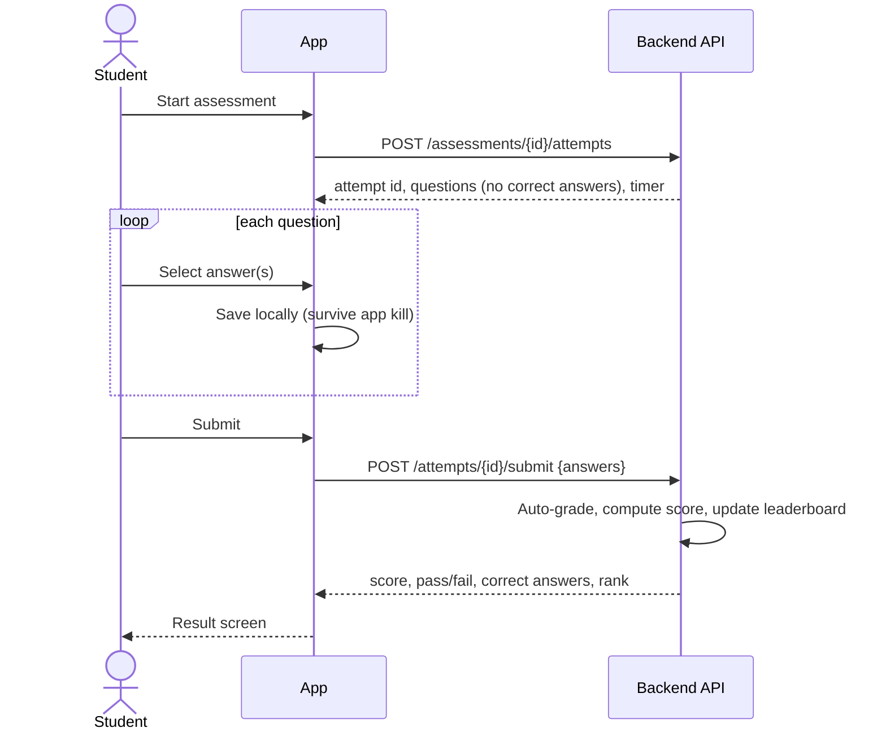

Guards: enforce attempts-allowed and time limit **server-side** (never trust the client).
Correct answers are only revealed after submit.

## LJ-5 — See my score vs other learners  ⭐ core

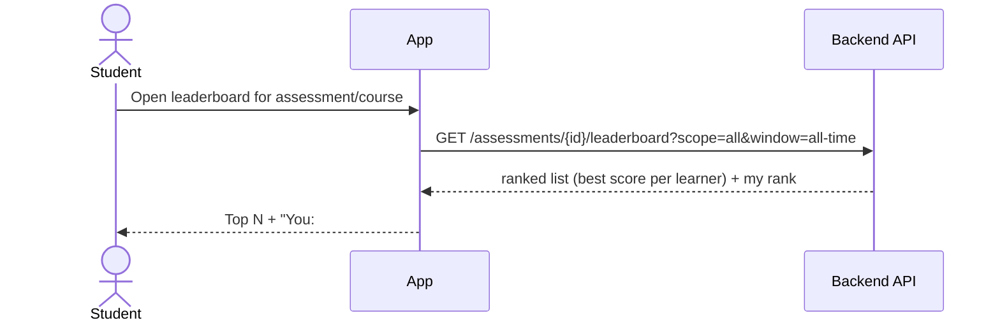

**Leaderboard rules:**
- Rank by **best score per learner** for that assessment (ties broken by earliest/fastest
  submission).
- A **course leaderboard** aggregates across the course's assessments (sum or average).
- Scopes to design for: `all learners`, `friends/cohort` (later), and time windows
  (`all-time`, `this week`).
- Privacy: display name or opt-in alias; allow a learner to appear anonymously.

## LJ-6 — Complete a course / earn recognition

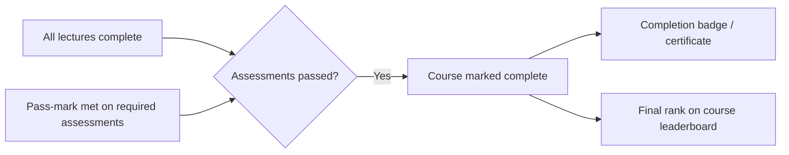

MVP: a completion badge + shareable summary. Formal certificates are a later phase.

---

## Cross-cutting journeys

| Journey | MVP? | Notes |
| --- | --- | --- |
| Sign up / sign in / sign out | ✅ | OIDC; learner role default, creator upgrade. |
| Edit profile & display name | ✅ | Display name feeds the leaderboard. |
| Offline viewing / progress sync | ⚠️ Partial | Progress syncs offline in MVP; full lecture download is a later phase. |
| Notifications (new course, result) | ❌ Later | Push via FCM. |
| Ratings & reviews | ❌ Later | Course quality signal. |
| Payments / paid courses | ❌ Later | Out of scope for MVP; keep the domain open to it. |
| Reporting / moderation | ❌ Later | Needed before public UGC at scale. |

---

## What these journeys pin down for the design

1. **Progress is a first-class aggregate** keyed by `(learner, lecture)` with idempotent
   upserts — it powers Resume, course %, and completion.
2. **Assessments are auto-gradable** in MVP, so **scoring + leaderboards need no human** in
   the loop.
3. **Video never flows through our backend** — direct upload to a provider, we store only
   playback ids and durations.
4. **Grading and attempt limits are server-authoritative** — the client is untrusted.
5. **The API is client-agnostic** — Android, iOS, and Web are three clients over one API.

Next: [ARCHITECTURE.md](ARCHITECTURE.md) turns these into a domain model and modules.
